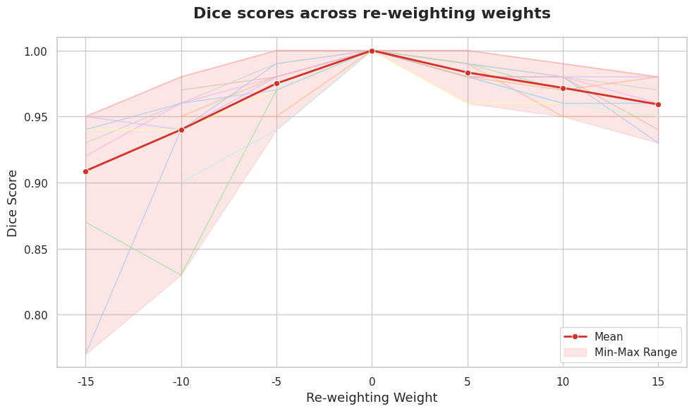
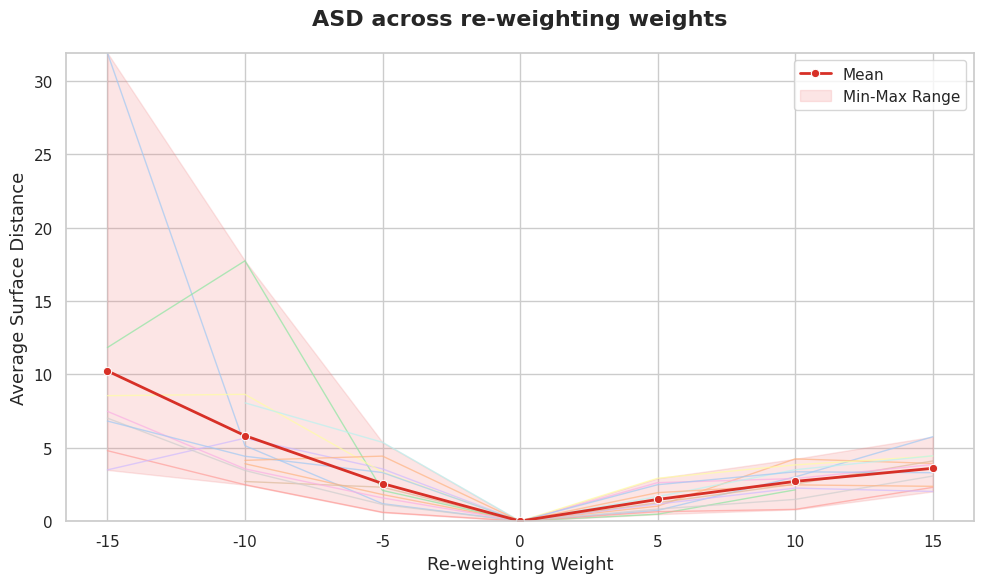
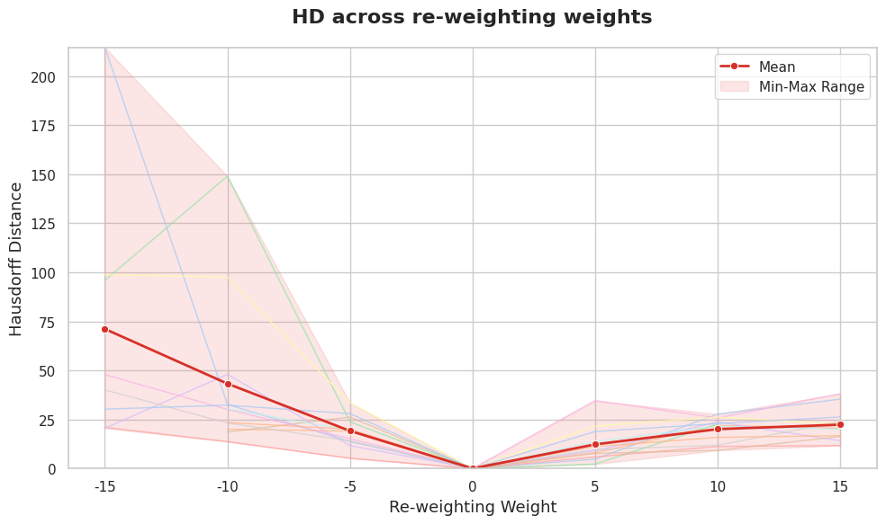

# Cross-Attention Control for Medical Image Editing

## 🔬 Overview

This project extends the [Nihirc/Prompt2MedImage](https://huggingface.co/nihirc/Prompt2MedImage) model with the **Cross-Attention Control** technique proposed in [Prompt-to-Prompt: Image Editing with Cross Attention Control](https://arxiv.org/abs/2208.01626) ([GitHub Repo](https://github.com/google/prompt-to-prompt)). Our goal is to enable **fine-grained, text-guided editing of medical images**—specifically **lung images**—while preserving **patient identity** and **anatomical consistency**. The core idea is to use **original and edited text prompts** to guide image generation via Prompt-to-Prompt’s attention manipulation. 

We explore and evaluate the method’s performance in the domain of **lung-related diseases**, specifically:

- **Lung Nodules**
- **Pneumonia**
- **Pleural Effusion**
- **Cardiomegaly**

Each disease is edited using the following tasks:

- **Adding** a disease  
- **Removing** a disease  
- **Re-weighting** (adjusting the prominence) of disease presence


To assess how well lung anatomy is preserved after editing, we developed two evaluation pipelines based on the **Segment Anything Models (SAM)** and the **TotalSegmentator** model. Both pipelines segment the **lung masks** from the original and edited images and compare them using segmentation metrics:

- **Dice Score**
- **Average Surface Distance (ASD)**
- **Hausdorff Distance (HD)**
---

## ❓ Research Question

**How well does the Cross-Attention Control technique work in the medical domain for editing pathology while preserving patient anatomy?**

---
## 📁 Repository Structure

```
.
├── prompt-to-prompt-Stablediffusion/
│   └── main.py                     # Image generation with editing tasks
├── evaluation_SAM/
│   └── main.py                     # Evaluation pipeline using SAM2
├── evaluation_totalsegmentator/
│   └── ...                         # Evaluation pipeline using TotalSegmentator
├── environment.yml                 # Conda environment definition
├── job.sbatch                      # SLURM job script for cluster runs
└── README.md
```

---

## 🚀 Getting Started

### 1. Environment Setup

Create and activate the environment:

```bash
conda env create -f environment.yml
conda activate ngoc_adlm_env_py310
```

---

### 2. Image Generation with Prompt-to-Prompt

The `prompt-to-prompt-Stablediffusion/main.py` demonstrates example edits including re-weighting, adding, and removing lung nodules:

```bash
python prompt-to-prompt-Stablediffusion/main.py
```
---

### 3. Evaluation: SAM Pipeline
The `evaluation_SAM/main.py` script demonstrates how to evaluate lung structure preservation using the SAM-based approach:

```bash
python evaluation_SAM/main.py
```

This will:
- Segment lungs from original and edited images
- Compute Dice, ASD, and HD metrics
- Plot evaluation results  

<!--  -->
<p align="center">
  
  
  
</p>

---

### 4. Evaluation: TotalSegmentator Pipeline

To evaluate using the second evaluation pipeline based on TotalSegmentator, refer to the setup and instructions in `evaluation_totalsegmentator/README.md`. 

---

## 🧵 Cluster Job Submission (Optional)

The `job.sbatch` file provides an example of how to run the experiments on an HPC cluster.

---

## 📌 Acknowledgments

- [Prompt-to-Prompt Image Editing with Cross Attention Control](https://github.com/google/prompt-to-prompt)
- [Prompt2MedImage](https://huggingface.co/nihirc/Prompt2MedImage)
- [Segment Anything Model 2 (SAM 2)](https://github.com/facebookresearch/sam2)
- [TotalSegmentator](https://github.com/wasserth/TotalSegmentator)

---

## 📧 Contact

**Ngoc Bach Doan**  
📫 bachngoc.doan@tum.de

**Ivan Rozhdestvenskii**
[@ivanrozhd](https://github.com/ivanrozhd)
